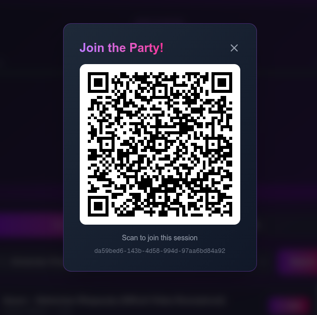
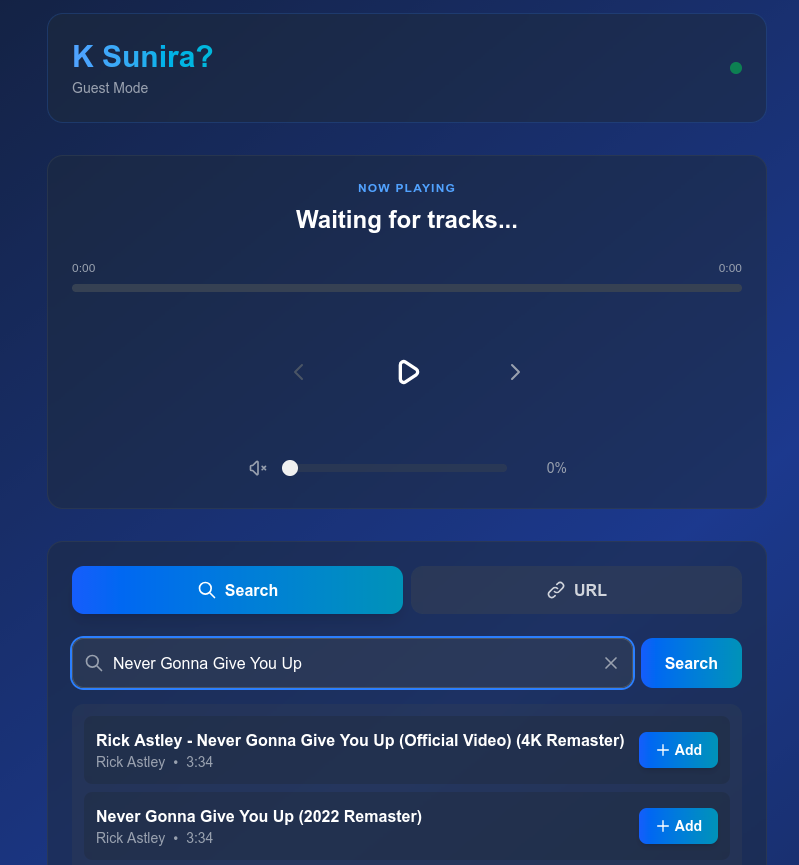
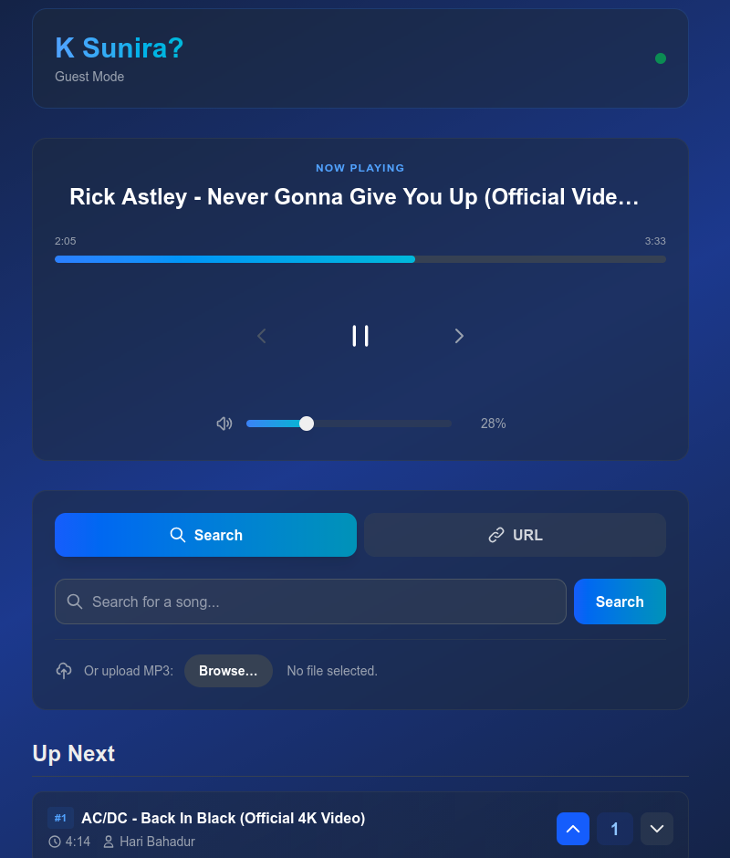

# K Sunira? - Party Music Player

Host listen together sessions with friends locally, vote the best songs and keep the party going!


## 🌟 Features
- **Real-time Collaboration**: Join a session via QR code or link and manage the queue together with friends.
- **YouTube Integration**: Search and add songs directly from YouTube with metadata extraction.
- **Local File Support**: Upload and play your own MP3 files from any device.
- **Voting System**: Democratic playlist management—songs with more votes play sooner.
- **Host-Guest Architecture**: The host device handles high-quality audio playback, while guests use their phones as remote controllers.
- **Ad-Free Experience**: Direct audio stream extraction for uninterrupted listening.
- **Cross-Device Support**: Works seamlessly on mobile and desktop browsers.

## 🐳 Quick Start

### Prerequisites
- [Docker](https://www.docker.com/) and [Docker Compose](https://docs.docker.com/compose/) installed.

### Steps
1. **Start the Application**
   
   Run the helper script to detect your LAN IP and start services:
   ```bash
   chmod +x start.sh && ./start.sh
   ```
   *(Or manually run `docker-compose up --build` if you prefer)*

3. **Access the App**

   The script will print the access URL.

5. **Host a new Session**
   
   

7. **Share the QR Code**

   Guests can scan the QR code on the host's screen to join immediately.
   
   

8. **Add Songs**
   
   

10. **Enjoy!**
    
   
